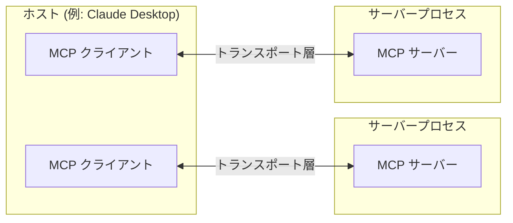
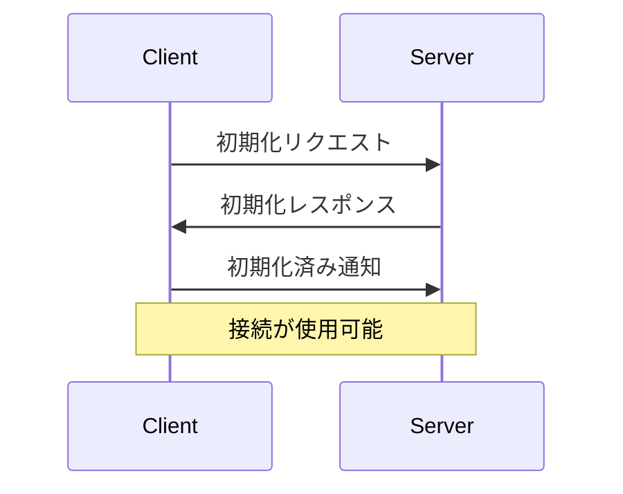

Model Context Protocol (MCP) は、LLMアプリケーションと統合間のシームレスな通信を可能にする柔軟で拡張可能なアーキテクチャに基づいて構築されています。このドキュメントでは、コアアーキテクチャのコンポーネントと概念について説明します。

## 概要

MCPはクライアントサーバーアーキテクチャに従います。

- **ホスト** は接続を開始するLLMアプリケーション（Claude DesktopやIDEなど）です。
- **クライアント** はホストアプリケーション内でサーバーと1対1の接続を維持します。
- **サーバー** はクライアントにコンテキスト、ツール、プロンプトを提供します。



## コアコンポーネント

### プロトコル層

プロトコル層は、メッセージのフレーミング、リクエスト/レスポンスのリンク、および高レベルの通信パターンを処理します。

<Tabs>
  <Tab title="TypeScript">
    ```typescript
    class Protocol<Request, Notification, Result> {
        // リクエストの処理
        setRequestHandler<T>(schema: T, handler: (request: T, extra: RequestHandlerExtra) => Promise<Result>): void

        // 通知の処理
        setNotificationHandler<T>(schema: T, handler: (notification: T) => Promise<void>): void

        // リクエストを送信し、レスポンスを待つ
        request<T>(request: Request, schema: T, options?: RequestOptions): Promise<T>

        // 一方向の通知を送信
        notification(notification: Notification): Promise<void>
    }
    ```
  </Tab>
  <Tab title="Python">
    ```python
    class Session(BaseSession[RequestT, NotificationT, ResultT]):
        async def send_request(
            self,
            request: RequestT,
            result_type: type[Result]
        ) -> Result:
            """
            リクエストを送信し、レスポンスを待ちます。レスポンスにエラーが含まれている場合、McpErrorを発生させます。
            """
            # リクエスト処理の実装

        async def send_notification(
            self,
            notification: NotificationT
        ) -> None:
            """レスポンスを期待しない一方向の通知を送信します。"""
            # 通知処理の実装

        async def _received_request(
            self,
            responder: RequestResponder[ReceiveRequestT, ResultT]
        ) -> None:
            """他の側からのリクエストを処理します。"""
            # リクエスト処理の実装

        async def _received_notification(
            self,
            notification: ReceiveNotificationT
        ) -> None:
            """他の側からの通知を処理します。"""
            # 通知処理の実装
    ```
  </Tab>
</Tabs>

主要なクラスには以下が含まれます：

* `Protocol`
* `Client`
* `Server`

### トランスポート層

トランスポート層は、クライアントとサーバー間の実際の通信を処理します。MCPは複数のトランスポートメカニズムをサポートしています：

1. **Stdioトランスポート**
   - 標準入力/出力を使用して通信
   - ローカルプロセスに最適

2. **HTTPとSSEトランスポート**
   - サーバーからクライアントへのメッセージにServer-Sent Eventsを使用
   - クライアントからサーバーへのメッセージにHTTP POSTを使用

すべてのトランスポートは、メッセージ交換に[JSON-RPC](https://www.jsonrpc.org/) 2.0を使用します。Model Context Protocolメッセージ形式の詳細については、[仕様](https://spec.modelcontextprotocol.io)を参照してください。

### メッセージタイプ

MCPには以下の主要なメッセージタイプがあります：

1. **リクエスト** は他の側からのレスポンスを期待します：
    ```typescript
    interface Request {
      method: string;
      params?: { ... };
    }
    ```

2. **結果** はリクエストに対する成功したレスポンスです：
    ```typescript
    interface Result {
      [key: string]: unknown;
    }
    ```

3. **エラー** はリクエストが失敗したことを示します：
    ```typescript
    interface Error {
      code: number;
      message: string;
      data?: unknown;
    }
    ```

4. **通知** はレスポンスを期待しない一方向のメッセージです：
    ```typescript
    interface Notification {
      method: string;
      params?: { ... };
    }
    ```

## 接続ライフサイクル

### 1. 初期化



1. クライアントはプロトコルバージョンと機能を含む`initialize`リクエストを送信します。
2. サーバーはそのプロトコルバージョンと機能で応答します。
3. クライアントは確認として`initialized`通知を送信します。
4. 通常のメッセージ交換が始まります。

### 2. メッセージ交換

初期化後、以下のパターンがサポートされます：

- **リクエスト-レスポンス**：クライアントまたはサーバーがリクエストを送信し、他方が応答します。
- **通知**：どちらのパーティも一方向のメッセージを送信します。

### 3. 終了

どちらのパーティも接続を終了できます：
- `close()`によるクリーンシャットダウン
- トランスポートの切断
- エラー条件

## エラー処理

MCPは以下の標準エラーコードを定義しています：

```typescript
enum ErrorCode {
  // 標準JSON-RPCエラーコード
  ParseError = -32700,
  InvalidRequest = -32600,
  MethodNotFound = -32601,
  InvalidParams = -32602,
  InternalError = -32603
}
```

SDKとアプリケーションは、-32000以上の独自のエラーコードを定義できます。

エラーは以下を通じて伝播されます：
- リクエストへのエラーレスポンス
- トランスポート上のエラーイベント
- プロトコルレベルのエラーハンドラ

## 実装例

以下はMCPサーバーを実装する基本的な例です：

<Tabs>
  <Tab title="TypeScript">
    ```typescript
    import { Server } from "@modelcontextprotocol/sdk/server/index.js";
    import { StdioServerTransport } from "@modelcontextprotocol/sdk/server/stdio.js";

    const server = new Server({
      name: "example-server",
      version: "1.0.0"
    }, {
      capabilities: {
        resources: {}
      }
    });

    // リクエストを処理
    server.setRequestHandler(ListResourcesRequestSchema, async () => {
      return {
        resources: [
          {
            uri: "example://resource",
            name: "Example Resource"
          }
        ]
      };
    });

    // トランスポートを接続
    const transport = new StdioServerTransport();
    await server.connect(transport);
    ```
  </Tab>
  <Tab title="Python">
    ```python
    import asyncio
    import mcp.types as types
    from mcp.server import Server
    from mcp.server.stdio import stdio_server

    app = Server("example-server")
    ```
  </Tab>
</Tabs> 