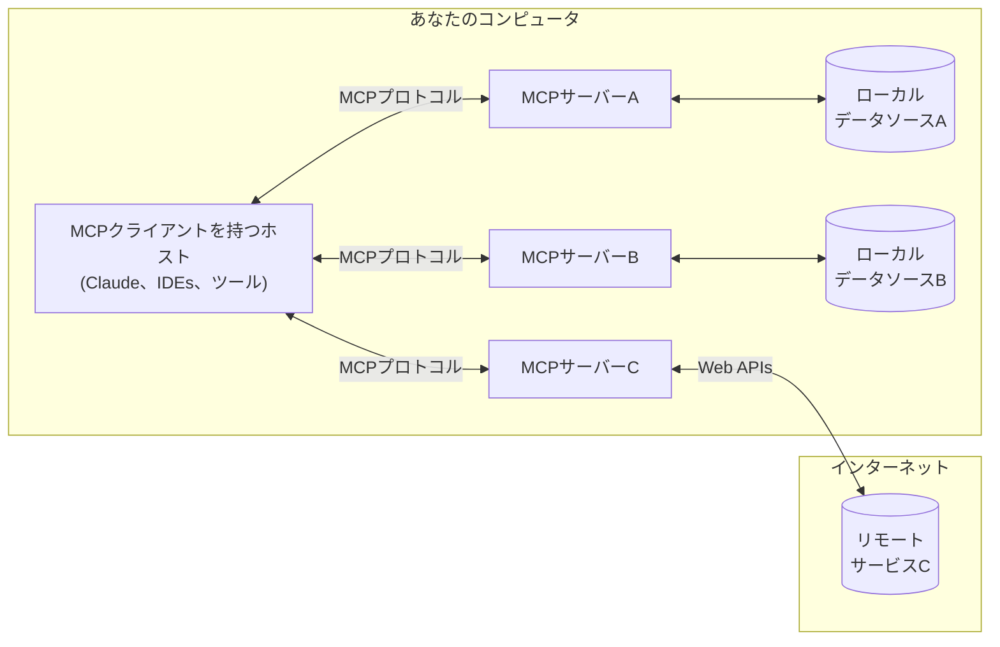

<Note>Java SDKがリリースされました！[最新情報はこちらをご覧ください。](/development/updates)</Note>

MCPは、アプリケーションがLLMにコンテキストを提供する方法を標準化するオープンプロトコルです。MCPをAIアプリケーションのためのUSB-Cポートのように考えてください。USB-Cがデバイスをさまざまな周辺機器やアクセサリに接続する標準化された方法を提供するのと同様に、MCPはAIモデルをさまざまなデータソースやツールに接続する標準化された方法を提供します。

## なぜMCPなのか？

MCPは、LLMの上にエージェントや複雑なワークフローを構築するのに役立ちます。LLMは頻繁にデータやツールと統合する必要があり、MCPは以下を提供します：
- LLMが直接プラグインできる事前構築された統合の増加リスト
- LLMプロバイダーやベンダー間の切り替えの柔軟性
- インフラストラクチャ内でデータを保護するためのベストプラクティス

### 一般的なアーキテクチャ

MCPのコアでは、ホストアプリケーションが複数のサーバーに接続できるクライアントサーバーアーキテクチャに従います：

- **MCPホスト**: Claude Desktop、IDEs、またはMCPを通じてデータにアクセスしたいAIツールなどのプログラム
- **MCPクライアント**: サーバーとの1対1の接続を維持するプロトコルクライアント
- **MCPサーバー**: 標準化されたModel Context Protocolを通じて特定の機能を公開する軽量プログラム
- **ローカルデータソース**: MCPサーバーが安全にアクセスできるコンピュータのファイル、データベース、サービス
- **リモートサービス**: MCPサーバーが接続できるインターネット上で利用可能な外部システム（例：APIを通じて）

## 始めましょう

あなたのニーズに最も適したパスを選択してください：

#### クイックスタート
<CardGroup cols={2}>
  <Card
    title="サーバー開発者向け"
    icon="bolt"
    href="/quickstart/server"
  >
    Claude for Desktopや他のクライアントで使用するための独自のサーバーを構築する
  </Card>
  <Card
    title="クライアント開発者向け"
    icon="bolt"
    href="/quickstart/client"
  >
    すべてのMCPサーバーと統合できる独自のクライアントを構築する
  </Card>
  <Card
    title="Claude Desktopユーザー向け"
    icon="bolt"
    href="/quickstart/user"
  >
    Claude for Desktopで事前構築されたサーバーを使用する
  </Card>
</CardGroup>

#### 例
<CardGroup cols={2}>
  <Card
    title="例のサーバー"
    icon="grid"
    href="/examples"
  >
    公式のMCPサーバーと実装のギャラリーをチェックする
  </Card>
  <Card
    title="例のクライアント"
    icon="cubes"
    href="/clients"
  >
    MCP統合をサポートするクライアントのリストを表示する
  </Card>
</CardGroup>

## チュートリアル

<CardGroup cols={2}>
  <Card
    title="LLMを使用したMCPの構築"
    icon="comments"
    href="/tutorials/building-mcp-with-llms"
  >
    ClaudeのようなLLMを使用してMCP開発を加速する方法を学ぶ
  </Card>
  <Card
  title="デバッグガイド"
  icon="bug"
  href="/docs/tools/debugging">
    MCPサーバーと統合を効果的にデバッグする方法を学ぶ
  </Card>
  <Card
    title="MCPインスペクター"
    icon="magnifying-glass"
    href="/docs/tools/inspector"
  >
    インタラクティブなデバッグツールでMCPサーバーをテストおよび検査する
  </Card>
</CardGroup>

## MCPを探る

MCPのコアコンセプトと機能を深く掘り下げる：

<CardGroup cols={2}>
  <Card
    title="コアアーキテクチャ"
    icon="sitemap"
    href="/docs/concepts/architecture"
  >
    MCPがクライアント、サーバー、LLMをどのように接続するかを理解する
  </Card>
  <Card
    title="リソース"
    icon="database"
    href="/docs/concepts/resources"
  >
    サーバーからLLMにデータとコンテンツを公開する
  </Card>
  <Card
    title="プロンプト"
    icon="message"
    href="/docs/concepts/prompts"
  >
    再利用可能なプロンプトテンプレートとワークフローを作成する
  </Card>
  <Card
    title="ツール"
    icon="wrench"
    href="/docs/concepts/tools"
  >
    サーバーを通じてLLMがアクションを実行できるようにする
  </Card>
  <Card
    title="サンプリング"
    icon="robot"
    href="/docs/concepts/sampling"
  >
    サーバーがLLMからの補完を要求できるようにする
  </Card>
  <Card
    title="トランスポート"
    icon="network-wired"
    href="/docs/concepts/transports"
  >
    MCPの通信メカニズムについて学ぶ
  </Card>
</CardGroup>

## 貢献

貢献したいですか？[貢献ガイド](/development/contributing)をチェックして、MCPの改善にどのように役立てるかを学んでください。

## サポートとフィードバック

ヘルプを得たりフィードバックを提供する方法：

- MCP仕様、SDK、ドキュメント（オープンソース）に関連するバグレポートや機能リクエストについては、[GitHub issueを作成してください](https://github.com/modelcontextprotocol)
- MCP仕様に関するディスカッションやQ&Aについては、[仕様ディスカッション](https://github.com/modelcontextprotocol/specification/discussions)を使用してください
- その他のMCPオープンソースコンポーネントに関するディスカッションやQ&Aについては、[組織ディスカッション](https://github.com/orgs/modelcontextprotocol/discussions)を使用してください
- Claude.appとclaude.aiのMCP統合に関連するバグレポート、機能リクエスト、質問については、mcp-support@anthropic.comにメールしてください 