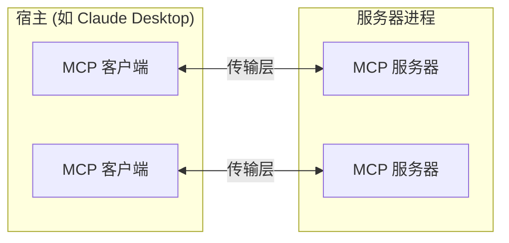

Model Context Protocol (MCP) 建立在灵活、可扩展的架构之上,实现了 LLM 应用程序和集成之间的无缝通信。本文档涵盖了核心架构组件和概念。

## 概述

MCP 遵循客户端-服务器架构,其中:

- **宿主** 是启动连接的 LLM 应用程序(如 Claude Desktop 或 IDE)
- **客户端** 在宿主应用程序内维护与服务器的 1:1 连接
- **服务器** 向客户端提供上下文、工具和提示



## 核心组件

### 协议层

协议层处理消息帧、请求/响应链接和高级通信模式。

<Tabs>
  <Tab title="TypeScript">
    ```typescript
    class Protocol<Request, Notification, Result> {
        // 处理传入请求
        setRequestHandler<T>(schema: T, handler: (request: T, extra: RequestHandlerExtra) => Promise<Result>): void

        // 处理传入通知
        setNotificationHandler<T>(schema: T, handler: (notification: T) => Promise<void>): void

        // 发送请求并等待响应
        request<T>(request: Request, schema: T, options?: RequestOptions): Promise<T>

        // 发送单向通知
        notification(notification: Notification): Promise<void>
    }
    ```
  </Tab>
  <Tab title="Python">
    ```python
    class Session(BaseSession[RequestT, NotificationT, ResultT]):
        async def send_request(
            self,
            request: RequestT,
            result_type: type[Result]
        ) -> Result:
            """
            发送请求并等待响应。如果响应包含错误则抛出 McpError。
            """
            # 请求处理实现

        async def send_notification(
            self,
            notification: NotificationT
        ) -> None:
            """发送不需要响应的单向通知。"""
            # 通知处理实现

        async def _received_request(
            self,
            # ... 其他代码 ...
    ```
  </Tab>
</Tabs>

## 最佳实践

### 传输选择

1. **本地通信**
   - 使用 stdio 传输用于本地进程
   - 适用于同一机器上的通信
   - 简单的进程管理

2. **远程通信**
   - 在需要 HTTP 兼容性的场景使用 SSE
   - 考虑包括认证和授权在内的安全影响

### 消息处理

1. **请求处理**
   - 彻底验证输入
   - 使用类型安全的模式
   - 优雅处理错误
   - 实现超时机制

2. **进度报告**
   - 对长时间操作使用进度令牌
   - 增量报告进度
   - 在已知时包含总进度

3. **错误管理**
   - 使用适当的错误代码
   - 包含有用的错误消息
   - 在错误时清理资源

## 安全考虑

1. **传输安全**
   - 对远程连接使用 TLS
   - 验证连接来源
   - 在需要时实现认证

2. **消息验证**
   - 验证所有传入消息
   - 净化输入
   - 检查消息大小限制
   - 验证 JSON-RPC 格式

3. **资源保护**
   - 实现访问控制
   - 验证资源路径
   - 监控资源使用
   - 限制请求速率

4. **错误处理**
   - 不要泄露敏感信息
   - 记录安全相关错误
   - 实现正确的清理
   - 处理 DoS 场景

## 调试和监控

1. **日志记录**
   - 记录协议事件
   - 跟踪消息流
   - 监控性能
   - 记录错误

2. **诊断**
   - 实现健康检查
   - 监控连接状态
   - 跟踪资源使用
   - 分析性能

3. **测试**
   - 测试不同的传输
   - 验证错误处理
   - 检查边缘情况
   - 负载测试服务器 