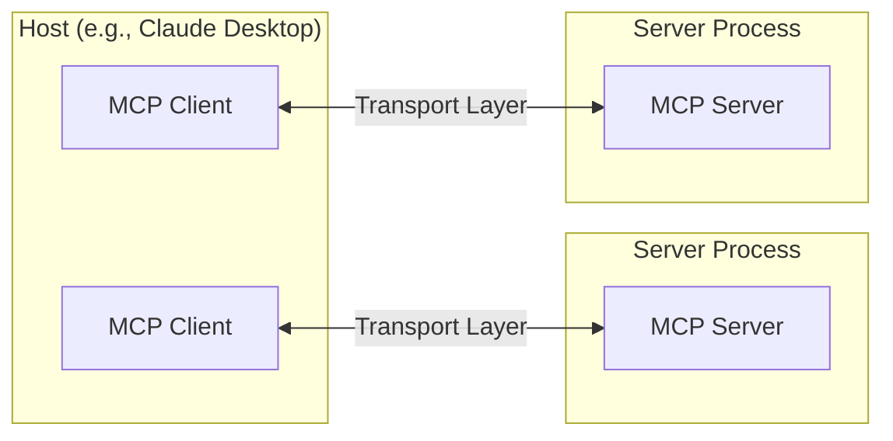
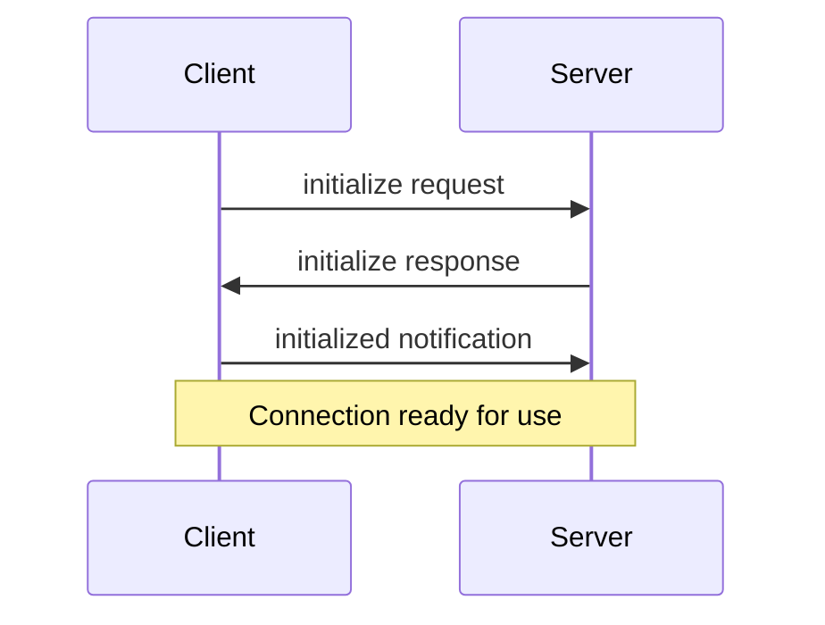

Model Context Protocol (MCP) 建構於彈性且可擴展的架構之上，實現 LLM 應用程式和整合之間的無縫通訊。本文檔涵蓋核心架構組件和概念。

## Overview

MCP 遵循客戶端-伺服器架構，其中：

- **Hosts** 是 LLM 應用程式（如 Claude Desktop 或 IDE），用於發起連線
- **Clients** 在主機應用程式內部維護與伺服器的 1:1 連線
- **Servers** 向客戶端提供上下文、工具和提示



## Core components

### Protocol layer

協議層處理消息成幀、請求/響應鏈接和高階通訊模式。

<Tabs>
  <Tab title="TypeScript">
    ```typescript
    class Protocol<Request, Notification, Result> {
        // Handle incoming requests
        setRequestHandler<T>(schema: T, handler: (request: T, extra: RequestHandlerExtra) => Promise<Result>): void

        // Handle incoming notifications
        setNotificationHandler<T>(schema: T, handler: (notification: T) => Promise<void>): void

        // Send requests and await responses
        request<T>(request: Request, schema: T, options?: RequestOptions): Promise<T>

        // Send one-way notifications
        notification(notification: Notification): Promise<void>
    }
    ```
  </Tab>
  <Tab title="Python">
    ```python
    class Session(BaseSession[RequestT, NotificationT, ResultT]):
        async def send_request(
            self,
            request: RequestT,
            result_type: type[Result]
        ) -> Result:
            """
            Send request and wait for response. Raises McpError if response contains error.
            """
            # Request handling implementation

        async def send_notification(
            self,
            notification: NotificationT
        ) -> None:
            """Send one-way notification that doesn't expect response."""
            # Notification handling implementation

        async def _received_request(
            self,
            responder: RequestResponder[ReceiveRequestT, ResultT]
        ) -> None:
            """Handle incoming request from other side."""
            # Request handling implementation

        async def _received_notification(
            self,
            notification: ReceiveNotificationT
        ) -> None:
            """Handle incoming notification from other side."""
            # Notification handling implementation
    ```
  </Tab>
</Tabs>

主要類別包括：

* `Protocol`
* `Client`
* `Server`

### Transport layer

傳輸層處理客戶端和伺服器之間的實際通訊。MCP 支援多種傳輸機制：

1. **Stdio transport**
   - 使用標準輸入/輸出進行通訊
   - 非常適合本地進程

2. **HTTP with SSE transport**
   - 使用伺服器發送事件 (Server-Sent Events) 進行伺服器到客戶端的消息傳輸
   - 使用 HTTP POST 進行客戶端到伺服器的消息傳輸

所有傳輸都使用 [JSON-RPC](https://www.jsonrpc.org/) 2.0 交換消息。有關 Model Context Protocol 消息格式的詳細信息，請參閱[規範](https://spec.modelcontextprotocol.io)。

### Message types

MCP 具有以下主要消息類型：

1. **Requests** 期望來自另一方的響應：
    ```typescript
    interface Request {
      method: string;
      params?: { ... };
    }
    ```

2. **Results** 是對請求的成功響應：
    ```typescript
    interface Result {
      [key: string]: unknown;
    }
    ```

3. **Errors** 表示請求失敗：
    ```typescript
    interface Error {
      code: number;
      message: string;
      data?: unknown;
    }
    ```

4. **Notifications** 是不期望響應的單向消息：
    ```typescript
    interface Notification {
      method: string;
      params?: { ... };
    }
    ```

## Connection lifecycle

### 1. Initialization



1. 客戶端發送 `initialize` 請求，包含協議版本和功能
2. 伺服器響應其協議版本和功能
3. 客戶端發送 `initialized` 通知作為確認
4. 開始正常消息交換

### 2. Message exchange

初始化後，支援以下模式：

- **Request-Response**：客戶端或伺服器發送請求，另一方響應
- **Notifications**：任何一方發送單向消息

### 3. Termination

任何一方都可以終止連線：
- 通過 `close()` 乾淨關閉
- 傳輸斷開
- 錯誤情況

## Error handling

MCP 定義了以下標準錯誤代碼：

```typescript
enum ErrorCode {
  // Standard JSON-RPC error codes
  ParseError = -32700,
  InvalidRequest = -32600,
  MethodNotFound = -32601,
  InvalidParams = -32602,
  InternalError = -32603
}
```

SDK 和應用程式可以定義高於 -32000 的自定義錯誤代碼。

錯誤通過以下方式傳播：
- 對請求的錯誤響應
- 傳輸上的錯誤事件
- 協議級別的錯誤處理程序

## Implementation example

以下是實現 MCP 伺服器的基本範例：

<Tabs>
  <Tab title="TypeScript">
    ```typescript
    import { Server } from "@modelcontextprotocol/sdk/server/index.js";
    import { StdioServerTransport } from "@modelcontextprotocol/sdk/server/stdio.js";

    const server = new Server({
      name: "example-server",
      version: "1.0.0"
    }, {
      capabilities: {
        resources: {}
      }
    });

    // Handle requests
    server.setRequestHandler(ListResourcesRequestSchema, async () => {
      return {
        resources: [
          {
            uri: "example://resource",
            name: "Example Resource"
          }
        ]
      };
    });

    // Connect transport
    const transport = new StdioServerTransport();
    await server.connect(transport);
    ```
  </Tab>
  <Tab title="Python">
    ```python
    import asyncio
    import mcp.types as types
    from mcp.server import Server
    from mcp.server.stdio import stdio_server

    app = Server("example-server")

    @app.list_resources()
    async def list_resources() -> list[types.Resource]:
        return [
            types.Resource(
                uri="example://resource",
                name="Example Resource"
            )
        ]

    async def main():
        async with stdio_server() as streams:
            await app.run(
                streams[0],
                streams[1],
                app.create_initialization_options()
            )

    if __name__ == "__main__":
        asyncio.run(main)
    ```
  </Tab>
</Tabs>

## Best practices

### Transport selection

1. **Local communication**
   - 對於本地進程，使用 stdio transport
   - 對於同一機器通訊非常有效
   - 簡單的進程管理

2. **Remote communication**
   - 對於需要 HTTP 兼容性的場景，使用 SSE
   - 考慮包括身份驗證和授權在內的安全隱患

### Message handling

1. **Request processing**
   - 徹底驗證輸入
   - 使用類型安全的模式
   - 優雅地處理錯誤
   - 實施超時

2. **Progress reporting**
   - 對於長時間運行的操作，使用進度令牌
   - 增量報告進度
   - 在已知時包含總進度

3. **Error management**
   - 使用適當的錯誤代碼
   - 包含有用的錯誤消息
   - 清理錯誤時的資源

## Security considerations

1. **Transport security**
   - 對於遠程連線，使用 TLS
   - 驗證連線來源
   - 在需要時實施身份驗證

2. **Message validation**
   - 驗證所有傳入的消息
   - 清理輸入
   - 檢查消息大小限制
   - 驗證 JSON-RPC 格式

3. **Resource protection**
   - 實施訪問控制
   - 驗證資源路徑
   - 監控資源使用情況
   - 速率限制請求

4. **Error handling**
   - 不要洩露敏感信息
   - 記錄與安全相關的錯誤
   - 實施適當的清理
   - 處理 DoS 場景

## Debugging and monitoring

1. **Logging**
   - 記錄協議事件
   - 追蹤消息流
   - 監控性能
   - 記錄錯誤

2. **Diagnostics**
   - 實施健康檢查
   - 監控連線狀態
   - 追蹤資源使用情況
   - 分析性能

3. **Testing**
   - 測試不同的傳輸
   - 驗證錯誤處理
   - 檢查邊緣情況
   - 負載測試伺服器