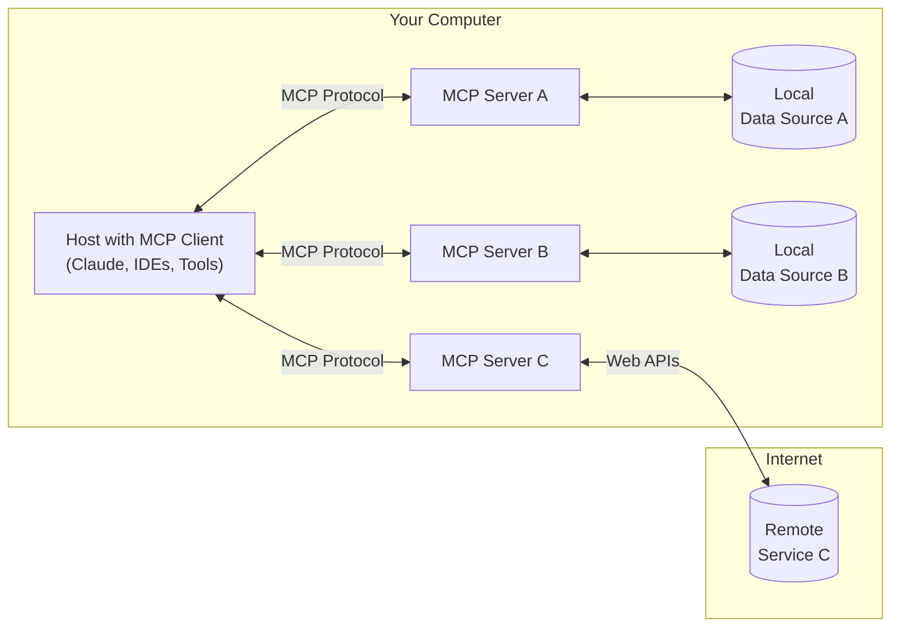

<Note>Java SDK 已發布！查看 [最新資訊。](/development/updates)</Note>

MCP 是一個開放協定，用於標準化應用程式如何向 LLM 提供上下文。將 MCP 想像成 AI 應用程式的 USB-C 連接埠。正如 USB-C 提供了一種標準化的方式來將您的裝置連接到各種周邊設備和配件，MCP 提供了一種標準化的方式來將 AI 模型連接到不同的資料來源和工具。

## Why MCP?

MCP 幫助您在 LLM 之上構建代理程式和複雜的工作流程。LLM 經常需要與資料和工具整合，而 MCP 提供了：
- 一份不斷增長的預建整合列表，您的 LLM 可以直接插入
- 在 LLM 提供商和供應商之間切換的靈活性
- 在您的基礎架構內保護資料的最佳實踐

### General architecture

MCP 的核心遵循客戶端-伺服器架構，其中主機應用程式可以連接到多個伺服器：

- **MCP Hosts**：希望通過 MCP 訪問資料的程式，例如 Claude Desktop、IDEs 或 AI 工具
- **MCP Clients**：與伺服器保持 1:1 連接的協定客戶端
- **MCP Servers**：輕量級程式，每個程式都通過標準化的 Model Context Protocol 暴露特定的功能
- **Local Data Sources**：您的電腦檔案、資料庫和服務，MCP 伺服器可以安全地訪問
- **Remote Services**：通過互聯網可用的外部系統（例如，通過 APIs），MCP 伺服器可以連接到

## Get started

選擇最適合您需求的途徑：

#### Quick Starts
<CardGroup cols={2}>
  <Card
    title="For Server Developers"
    icon="bolt"
    href="/quickstart/server"
  >
    開始構建您自己的伺服器，以便在 Claude for Desktop 和其他客戶端中使用
  </Card>
  <Card
    title="For Client Developers"
    icon="bolt"
    href="/quickstart/client"
  >
    開始構建您自己的客戶端，該客戶端可以與所有 MCP 伺服器整合
  </Card>
  <Card
    title="For Claude Desktop Users"
    icon="bolt"
    href="/quickstart/user"
  >
    開始在 Claude for Desktop 中使用預建伺服器
  </Card>
</CardGroup>

#### Examples
<CardGroup cols={2}>
  <Card
    title="Example Servers"
    icon="grid"
    href="/examples"
  >
    查看我們的官方 MCP 伺服器和實作範例庫
  </Card>
  <Card
    title="Example Clients"
    icon="cubes"
    href="/clients"
  >
    查看支援 MCP 整合的客戶端列表
  </Card>
</CardGroup>

## Tutorials

<CardGroup cols={2}>
  <Card
    title="Building MCP with LLMs"
    icon="comments"
    href="/tutorials/building-mcp-with-llms"
  >
    了解如何使用像 Claude 這樣的 LLM 來加速您的 MCP 開發
  </Card>
  <Card
  title="Debugging Guide"
  icon="bug"
  href="/docs/tools/debugging">
    了解如何有效地調試 MCP 伺服器和整合
  </Card>
  <Card
    title="MCP Inspector"
    icon="magnifying-glass"
    href="/docs/tools/inspector"
  >
    使用我們的互動式調試工具測試和檢查您的 MCP 伺服器
  </Card>
</CardGroup>

## Explore MCP

深入了解 MCP 的核心概念和功能：

<CardGroup cols={2}>
  <Card
    title="Core architecture"
    icon="sitemap"
    href="/docs/concepts/architecture"
  >
    了解 MCP 如何連接客戶端、伺服器和 LLM
  </Card>
  <Card
    title="Resources"
    icon="database"
    href="/docs/concepts/resources"
  >
    從您的伺服器向 LLM 暴露資料和內容
  </Card>
  <Card
    title="Prompts"
    icon="message"
    href="/docs/concepts/prompts"
  >
    創建可重複使用的提示範本和工作流程
  </Card>
  <Card
    title="Tools"
    icon="wrench"
    href="/docs/concepts/tools"
  >
    使 LLM 能夠通過您的伺服器執行操作
  </Card>
  <Card
    title="Sampling"
    icon="robot"
    href="/docs/concepts/sampling"
  >
    讓您的伺服器從 LLM 請求補全
  </Card>
  <Card
    title="Transports"
    icon="network-wired"
    href="/docs/concepts/transports"
  >
    了解 MCP 的通信機制
  </Card>
</CardGroup>

## Contributing

想要貢獻嗎？查看我們的 [Contributing Guide](/development/contributing) 以了解如何幫助改進 MCP。

## Support and Feedback

以下是如何獲得幫助或提供回饋：

- 對於與 MCP 規範、SDK 或文件（開源）相關的錯誤報告和功能請求，請[創建一個 GitHub issue](https://github.com/modelcontextprotocol)
- 對於關於 MCP 規範的討論或問答，請使用 [specification discussions](https://github.com/modelcontextprotocol/specification/discussions)
- 對於關於其他 MCP 開源組件的討論或問答，請使用 [organization discussions](https://github.com/orgs/modelcontextprotocol/discussions)
- 對於與 Claude.app 和 claude.ai 的 MCP 整合相關的錯誤報告、功能請求和問題，請發送電子郵件至 mcp-support@anthropic.com